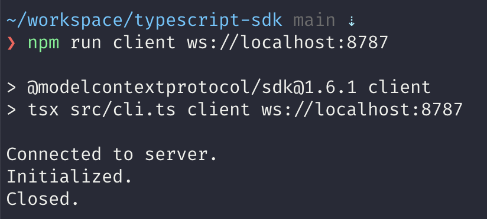

# Websocket MCP Server + Durable Objects

1. A Minimal Websocket Transport layer that works with `@modelcontextprotocol/typescript-sdk` (`/src/websocket.ts`)
2. A MCP Server as a Durable Object (`/src/index.ts`)
3. Steps to run it end-to-end

## Run it

1. Clone this repo
2. `npm install`
3. `npm start` to start the DO (at `http://localhost:8787`)
4. Within the [`@modelcontextprotocol/typescript-sdk` repo](https://github.com/modelcontextprotocol/typescript-sdk) run `npm install && npm run client ws://localhost:8787`

You should see:

## Details

This is based around [this example](https://github.com/irvinebroque/mcp-server-do/) however I swapped the SSE transport implementation for a
minimal websocket example.
